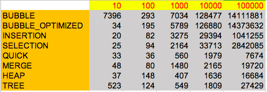

## Implementation of different sorting  algorithms and comparison with real data

## Sorting Algos implemented

* [Bubble Sort](Compare-Sorting/src/main/java/com/nagendra547/sort/BubbleSort.java)
* [Bubble SortOptimized](Compare-Sorting/src/main/java/com/nagendra547/sort/BubbleSortOptimized.java)
* [Heap Sort](Compare-Sorting/src/main/java/com/nagendra547/sort/HeapSort.java)
* [Insertion Sort](Compare-Sorting/src/main/java/com/nagendra547/sort/InsertionSort.java)
* [Merge Sort](Compare-Sorting/src/main/java/com/nagendra547/sort/MergeSort.java)
* [Quick Sort](Compare-Sorting/src/main/java/com/nagendra547/sort/QuickSort.java)
* [Selection Sort](Compare-Sorting/src/main/java/com/nagendra547/sort/SelectionSort.java)
* [Tree Sort](Compare-Sorting/src/main/java/com/nagendra547/sort/TreeSort.java)

